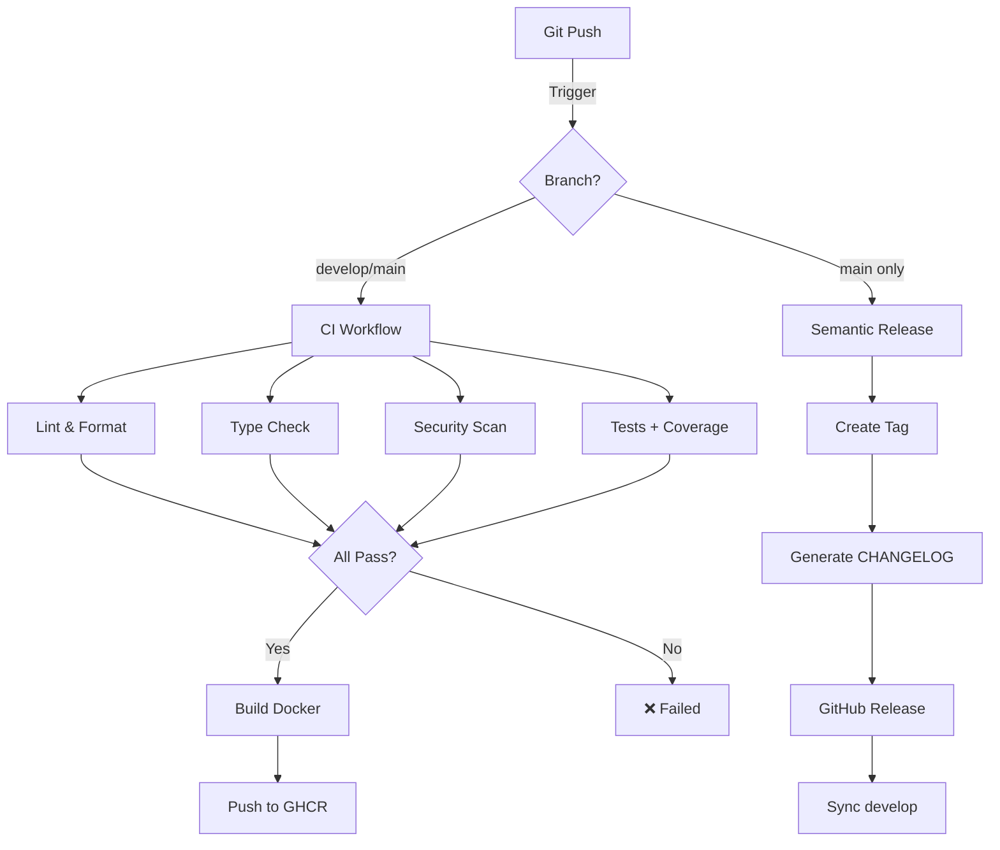

# 🔄 Pipeline CI/CD

## Vue d'ensemble

Ce projet implémente une pipeline CI/CD complète avec GitHub Actions.

## Architecture



## Workflows

| Workflow | Trigger | Description |
|----------|---------|-------------|
| **CI** | Push/PR sur main/develop | Tests, linting, type checking, security |
| **Build** | Push sur main/develop | Build et push image Docker vers GHCR |
| **Release** | Push sur main | Semantic release automatique |
| **Sync** | Release | Synchronise develop avec main |
| **Docs** | Push sur main | Déploie la documentation sur GitHub Pages |

## Jobs CI en Détail

### 1. Lint & Format Check
- **Outil** : Ruff
- **Durée** : ~5s
- **Vérifie** : Style de code, imports, formatage

### 2. Type Checking
- **Outil** : Mypy
- **Durée** : ~10s
- **Vérifie** : Annotations de types

### 3. Security Scan
- **Outils** : Bandit, Safety
- **Durée** : ~15s
- **Vérifie** : Vulnérabilités code & dépendances

### 4. Tests & Coverage
- **Outil** : pytest
- **Durée** : ~20s
- **Vérifie** : Tests unitaires, couverture de code

## Badges

```markdown


```
