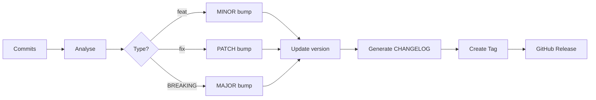

# 📦 Semantic Release

Versionnage automatique basé sur les commits conventionnels.

## Fonctionnement



## Conventional Commits

### Format

```
<type>(<scope>): <description>

[optional body]

[optional footer]
```

### Types et Impact

| Type | Description | Version Bump | Exemple |
|------|-------------|--------------|---------|
| `feat` | Nouvelle fonctionnalité | **MINOR** (0.1.0 → 0.2.0) | `feat: add pagination` |
| `fix` | Correction de bug | **PATCH** (0.1.0 → 0.1.1) | `fix: null check` |
| `feat!` | Breaking change | **MAJOR** (0.1.0 → 1.0.0) | `feat!: redesign API` |
| `docs` | Documentation | ❌ Aucun | `docs: update README` |
| `style` | Formatage | ❌ Aucun | `style: format code` |
| `refactor` | Refactoring | ❌ Aucun | `refactor: extract service` |
| `test` | Tests | ❌ Aucun | `test: add unit tests` |
| `chore` | Maintenance | ❌ Aucun | `chore: update deps` |
| `ci` | CI/CD | ❌ Aucun | `ci: fix workflow` |

### Exemples

#### Feature (MINOR)
```bash
git commit -m "feat(items): add pagination support"
# 0.1.0 → 0.2.0
```

#### Fix (PATCH)
```bash
git commit -m "fix(api): handle null values correctly"
# 0.2.0 → 0.2.1
```

#### Breaking Change (MAJOR)
```bash
git commit -m "feat!: redesign API endpoints

BREAKING CHANGE: all endpoints now use /api/v2 prefix"
# 0.2.1 → 1.0.0
```

## Workflow de Release

1. **Developer** merge PR dans `main`
2. **CI** s'exécute et passe
3. **Semantic Release** :
   - Analyse les commits depuis dernière version
   - Calcule la nouvelle version
   - Met à jour `pyproject.toml`
   - Génère `CHANGELOG.md`
   - Crée un tag Git (ex: `v1.0.0`)
   - Crée une GitHub Release
4. **Sync** : Merge `main` → `develop`

## Configuration

Dans `pyproject.toml` :

```toml
[tool.semantic_release]
version_toml = ["pyproject.toml:project.version"]
changelog_file = "CHANGELOG.md"

[tool.semantic_release.branches.main]
match = "main"
prerelease = false

[tool.semantic_release.branches.develop]
match = "develop"
prerelease = true
prerelease_token = "dev"
```

## Bonnes Pratiques

✅ **À faire** :
- Utiliser le bon type de commit
- Décrire clairement le changement
- Ajouter un scope si pertinent
- Documenter les breaking changes

❌ **À éviter** :
- Commits vagues : `git commit -m "fix stuff"`
- Mélanger plusieurs types de changements
- Oublier le `!` pour breaking changes
