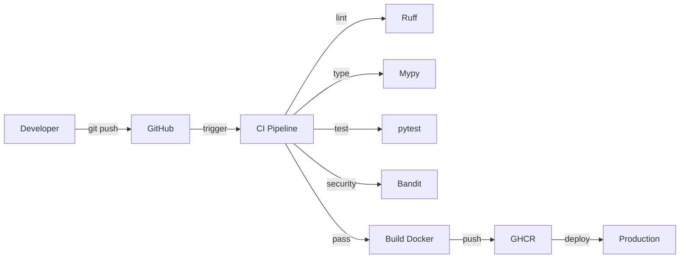

# 🚀 Items API - Documentation

Bienvenue dans la documentation de l'API Items, un projet de démonstration d'une **pipeline CI/CD professionnelle complète**.

## 🎯 À propos

Cette API REST démontre l'implémentation de bonnes pratiques DevOps modernes :

- ✅ **CI/CD complète** avec GitHub Actions
- ✅ **Tests automatisés** avec coverage
- ✅ **Quality gates** (linting, type checking, security)
- ✅ **Pre-commit hooks** pour un développement efficace
- ✅ **Semantic Release** avec versionnage automatique
- ✅ **Documentation auto-générée** depuis les docstrings
- ✅ **Containerisation** Docker avec GHCR

## 🛠️ Stack Technique

### Backend
- **FastAPI** - Framework web moderne et performant
- **SQLModel** - ORM type-safe basé sur Pydantic et SQLAlchemy
- **PostgreSQL** - Base de données relationnelle
- **uv** - Gestionnaire de paquets ultra-rapide

### DevOps
- **GitHub Actions** - CI/CD platform
- **Ruff** - Linter et formatter Python (10-100x plus rapide)
- **Mypy** - Type checker statique
- **pytest** - Framework de tests
- **Bandit** - Security scanner
- **pre-commit** - Git hooks automatiques
- **python-semantic-release** - Versionnage automatique

## 📚 Navigation

<div class="grid cards" markdown>

-   :material-rocket-launch:{ .lg .middle } __Démarrage Rapide__

    ---

    Installation et premier lancement en 5 minutes

    [:octicons-arrow-right-24: Commencer](getting-started.md)

-   :material-api:{ .lg .middle } __API Reference__

    ---

    Documentation complète de tous les endpoints

    [:octicons-arrow-right-24: Explorer l'API](api/routes.md)

-   :material-cog:{ .lg .middle } __CI/CD__

    ---

    Comprendre le pipeline et les workflows

    [:octicons-arrow-right-24: Pipeline CI/CD](cicd/overview.md)

-   :material-docker:{ .lg .middle } __Docker__

    ---

    Build et déploiement containerisé

    [:octicons-arrow-right-24: Guide Docker](guides/docker.md)

</div>

## 🚀 Quick Start

```bash
# Cloner le projet
git clone https://github.com/RaoufAddeche/brief-ci-cd-semantic-release-mkdocs.git
cd brief-ci-cd-semantic-release-mkdocs

# Installer uv
curl -LsSf https://astral.sh/uv/install.sh | sh

# Installer les dépendances
uv sync

# Lancer l'application
uv run fastapi dev app/main.py
```

Ouvrez [http://localhost:8000/docs](http://localhost:8000/docs) pour accéder à la documentation interactive Swagger.

## 📊 Architecture



## 🔗 Liens Utiles

- [GitHub Repository](https://github.com/RaoufAddeche/brief-ci-cd-semantic-release-mkdocs)
- [API Documentation (Swagger)](http://localhost:8000/docs)
- [CI/CD Pipeline](https://github.com/RaoufAddeche/brief-ci-cd-semantic-release-mkdocs/actions)
- [Docker Image (GHCR)](https://github.com/RaoufAddeche/brief-ci-cd-semantic-release-mkdocs/pkgs/container/brief-ci-cd-semantic-release-mkdocs)

## 📄 Licence

MIT License - Projet éducatif
